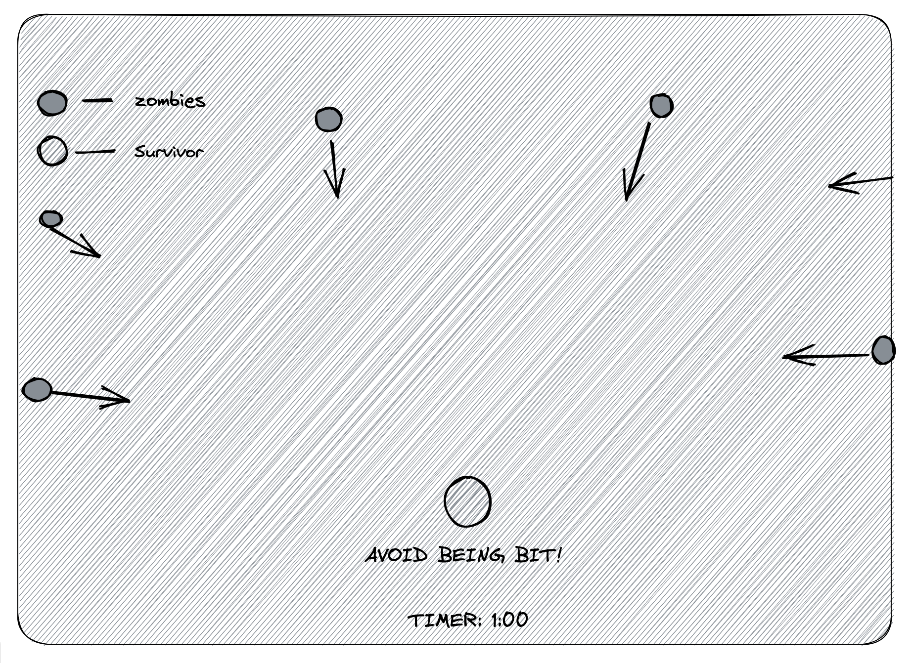

# Dead-Man-Walking - Zombie Survival Game

## The Game

Welcome to the Zombie Survival Game! The horde of zombies has broken through the fence and is coming for you! The only way to survive is to disguise yourself so that they don't recognize you as a living human. You have to survive for 60 seconds without being touched by any zombies for help to arrive.

But be careful! If you touch a zombie, they will know that you're alive and it's game over. Move quickly and stay alert to avoid the zombies and survive until the timer runs out.

Do you have what it takes to survive the zombie apocalypse? Play the game and find out!

## How to Play
Click on the "Start" button to begin the game.
Read the rules by clicking on the "Rules" button.

## Controls
Use the arrow keys for movement (UP, DOWN, LEFT, RIGHT) to control the survivor.
Survive for 60 seconds without being touched by any zombies.
If you touch a zombie, the game is over.
Move quickly and stay alert to avoid the zombies.
Good luck!

## Installation
To play the game, you need to clone this repository from GitHub (https://github.com/IsaacDatColt/Dead-Man-Walking) to your local machine and open the index.html file in your browser.

Or just use this link! 
https://dead-man-walking.netlify.app/

## Technologies Used
HTML
CSS
JavaScript

## Code snippets
Here is the movement for the zombies using a randomising function for the arrow keys. They move at random and in a downward trend by adjusting the x and y lengths on each key. 
```
//ZOMBIE MOVEMENT LOGIC

function moveZombie(zombie) {
  const directions = ['ArrowUp', 'ArrowDown', 'ArrowLeft', 'ArrowRight'];
  const randomDirection = directions[Math.floor(Math.random() * directions.length)];
  if (randomDirection === 'ArrowDown') {
    zombie.y + 15 <= canvas.height - zombie.height ? (zombie.y += 8) : null;
  } else if (randomDirection === 'ArrowRight') {
    zombie.x + 6 <= canvas.width - zombie.width ? (zombie.x += 7) : null;
  } else if (randomDirection === 'ArrowLeft') {
    zombie.x - 10 >= 0 ? (zombie.x -= 7) : null;
  } else if (randomDirection === 'ArrowUp') {
    zombie.y - 10 >= 0 ? (zombie.y -= 2) : null;

  }
}
```
## Code snippet/ Code Blocker 

This is a code I took time to figure out as I was stuck in figuring out how to get constant spawning of zombies in different locations. 

This code is defining a function called "zombieLoop" and setting up a timer using the "setInterval" function. I needed multiple zombies to appear in multiple areas of the game.The "zombieLoop" function is called every time the timer is triggered. I created the timer to slow the speed in which zombies were being rendered because of the gameLoop. The "setInterval" function creates a timer that runs every 300 milliseconds. Within the timer, a new zombie is added to the "zombies" array every time the number of zombies is less than 400.  Inside the "zombieLoop" a new zombie is generated with a 0.0015% chance of spawning when the function is called as part of the speed I wanted the zombies to go. 

 
```
function zombieLoop() {
  ctx.imageSmoothingEnabled = false;
  

    if (Math.random() < 0.0015) { // add a new zombie with a 0.0015% chance to enter every 300s of a seconds
      numZombies++;
    }

  for (let i = 0; i < numZombies; i++) {
    moveZombie(zombies[i]);
    zombies[i].render();
  }
}

// Zombie spawn Timer
setInterval(() => {
  if (numZombies < 400) {
    zombies.push(new Zombie(canvas.width / 2, 0, zomb, 40, 40, 1200));
    zombies.push(new Zombie(0, 300, zomb, 40, 40, 1200));
    zombies.push(new Zombie(0, 100, zomb, 40, 40, 1200));
    zombies.push(new Zombie(100, 0, zomb, 40, 40, 1200));
    zombies.push(new Zombie(880, 0, zomb, 40, 40, 1200));
    zombies.push(new Zombie(850, 0, zomb, 40, 40, 1200));
    zombies.push(new Zombie(800, 0, zomb, 40, 40, 1200));
    zombies.push(new Zombie(300, 0, zomb, 40, 40, 1200));
    zombies.push(new Zombie(500, 0, zomb, 40, 40, 1200));
    zombies.push(new Zombie(400, 0, zomb, 40, 40, 1200));
    zombies.push(new Zombie(960, 0, zomb, 40, 40, 1200));
    zombies.push(new Zombie(1060, 0, zomb, 40, 40, 1200));
    zombies.push(new Zombie(1000, 0, zomb, 40, 40, 1200));
    zombies.push(new Zombie(800, 0, zomb, 40, 40, 1200));
    zombies.push(new Zombie(1000, 0, zomb, 40, 40, 1200));
    zombies.push(new Zombie(880, 0, zomb, 40, 40, 1200));
    zombies.push(new Zombie(300, 0, zomb, 40, 40, 1200));
    zombies.push(new Zombie(160, 0, zomb, 40, 40, 1200));
    zombies.push(new Zombie(500, 0, zomb, 40, 40, 1200));
    zombies.push(new Zombie(700, 0, zomb, 40, 40, 1200));
    zombies.push(new Zombie(260, 0, zomb, 40, 40, 1200));
    zombies.push(new Zombie(560, 0, zomb, 40, 40, 1200));
    zombies.push(new Zombie(1000, 0, zomb, 40, 40, 1200));
    zombies.push(new Zombie(125, 0, zomb, 40, 40, 1200));
    zombies.push(new Zombie(0, 150, zomb, 40, 40, 1200));
    zombies.push(new Zombie(0, 300, zomb, 40, 40, 1200));


    numZombies++;
  }
 
}, 300);
```

## How it started
Inspired by tv shows and the thrill of surviving a zombie apocalypse, I wanted to make a game that has a story for every level or map that can be played.  

## My sketch: 


## Future Goals/Considerations
- [ ]I want to be able to add more features to the game such as weapons, zombie vaccine, health bar/timer. The idea will be to have weapons drop for a certain amount of time and if you find your way to them, you will be able to use them for a certain amount of time. Vaccine will be like a 2nd chance at life if you get bit. Get it and use it before you turn to a zombie!

-[ ] I also want to add different forms of zombies that have different attributes to them such as moving faster or jumping and even spitting of some sort.

-[ ] I want to add different levels and maps with objects in the game that you can use to your advantage or they can get in the way. Things like boulders, cars, trees. 


## Credits
This game was created by Isaac Guzman. It was built with HTML, CSS, and JavaScript.

## License
This project is licensed under the MIT License. See the LICENSE file for more information.

## Created By: Isaac Guzman


